<p align="center">
  
</p>

<h1 align="center">Mandate</h1>

<p align="center">
  <b>Delegate a purchase with limits you can enforce, and inspect every decision.</b><br>
  A shopping agent that can only spend inside rules you set, check and revoke.<br>
  HacKU 2026 · PS1 FinTech · Team 45 <i>wayme</i>
</p>

<p align="center">
  <a href="docs/media/mandate-demo.mp4">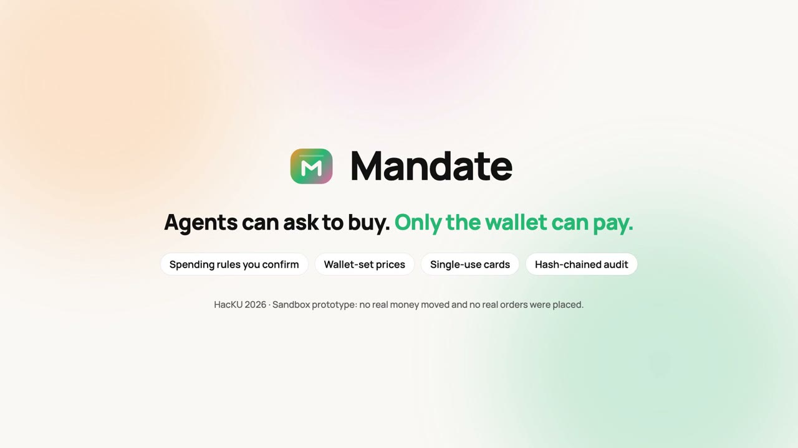</a><br>
  <sub>▶ <a href="docs/media/mandate-demo.mp4"><b>Watch the 2-minute demo</b></a> · <a href="docs/media/mandate-reel.mp4">52-second reel</a> · all payments run in a local sandbox. <b>No real funds move.</b></sub>
</p>

### In the demo

| | Scene | What it shows |
|:-:|---|---|
| 1 | **Ask once. See the options.** | Kumi searches shops for a 65W charger under HK$400 and lays out each match with photo, price and why it qualifies (recorded search sample, not live) |
| 2 | **Kumi packs the basket** | Picks from a preset list using timestamped Wellcome prices. It never sets a price |
| 3 | **Sneak in champagne? Refused.** | Kip, the wallet, refuses the HK$1,406 basket: blocked category, over the order cap and the weekly budget. Nothing is paid |
| 4 | **Two orders race. One wins.** | Two HK$300 orders hit HK$400 left at once. The naive wallet pays both; Mandate approves one, measured over real HTTP, and a Z3 model checks the design |
| 5 | **A log you can check** | One old amount is edited; the independent verifier reports `HASH_MISMATCH` |
| 6 | **Attack lab** | Attacks run one by one against a throwaway wallet; money moved stays HK$0.00 |
| 7 | **Checked, not just claimed** | 20/20 safety scenarios, HK$0 overspend in the race, 5/5 tampered logs detected |

## The idea

Giving an agent your card gives it everything. A product page can tell it to buy something else, totals change at checkout, two agents can spend the same budget at once, and afterwards nobody can prove what happened.

Mandate splits the job. **The agent chooses. The wallet decides.**

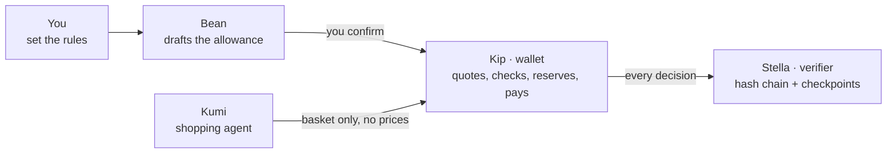

> “Buy Mum’s groceries. At most HK$800 a week and HK$300 an order, only these shops, no alcohol.”

1. **You set the rules.** Budget, per-order cap, shops, never-buy categories, expiry. Nothing is live until you confirm.
2. **Kumi shops.** Reads a typed or spoken list and picks products. It never writes a price and never sees blocked items.
3. **The wallet quotes and checks.** It computes the total from its own catalog, checks every rule and reserves the budget atomically.
4. **It pays once, exactly.** An Ed25519-signed authorization for that exact quote, paid with a single-use card in the sandbox.
5. **Every decision is logged.** A hash-chained audit stream, checked by an independent verifier process.

<p align="center"></p>

## What it looks like

| Ask Kumi | Set the allowance | Review the total | Paid within the rules | Refused, with the reason | Wallet controls |
|:-:|:-:|:-:|:-:|:-:|:-:|
| 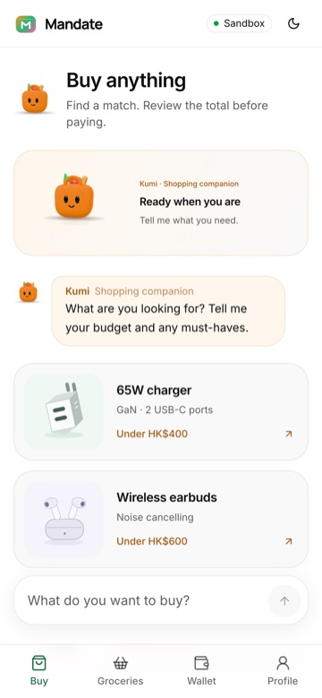 | 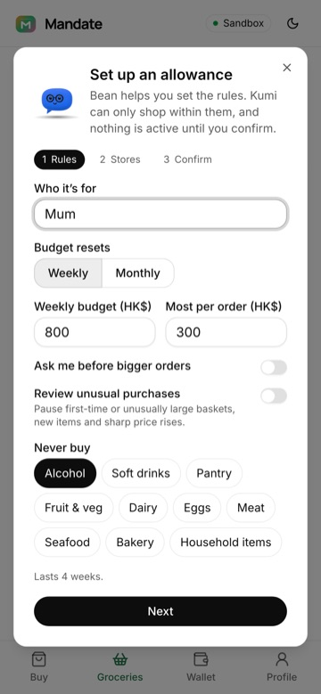 | 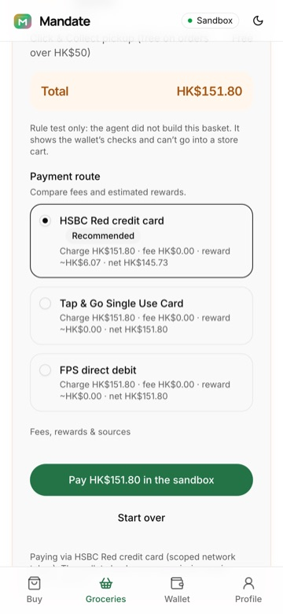 | 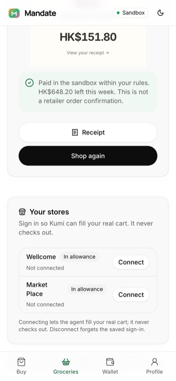 | 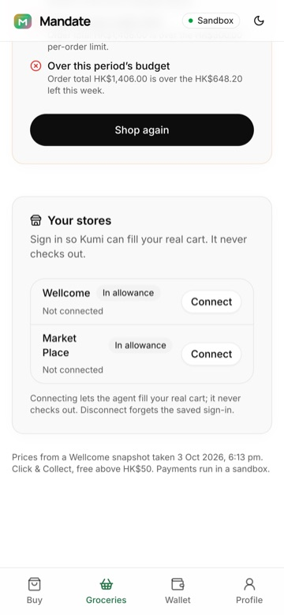 | 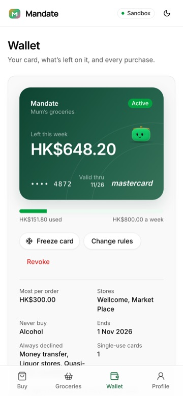 |

Prices come from a timestamped Wellcome capture (3 Oct 2026, 6:13 pm). The owner can freeze the card, change the rules or revoke at any time; bigger orders and a new shop's first order wait for approval.

## Proof, not promises

<p align="center">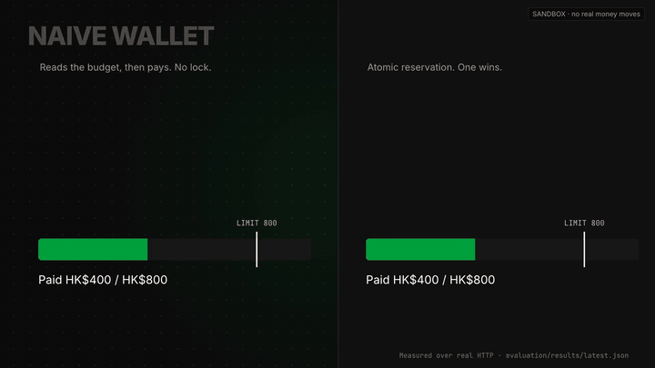</p>

**Two agents, HK$400 left, both ask for HK$300 at the same moment (real HTTP):**

| | Approved | Week ends at | Over the limit |
|---|:-:|:-:|:-:|
| Naive wallet (check, then reserve) | 2 | HK$1,000 of HK$800 | **HK$200** |
| Mandate (atomic reservation) | 1 (other refused: `PERIOD_BUDGET_EXCEEDED`) | HK$700 of HK$800 | **HK$0** |

**Z3, every interleaving up to 8 steps:** the check-then-reserve model has a 6-step counterexample; the atomic model has none within the bound. This is a bounded model result, not a proof of the deployed wallet.

**Nobody can quietly rewrite history.** Wallet decisions are hash-chained; a signed checkpoint is retained by a separate verifier with its own data and pinned key. 5/5 edits caught (changed amount, changed and rehashed, deleted event, truncated log). Without a retained checkpoint the result is never a pass.

| Original export | One amount edited |
|:-:|:-:|
| 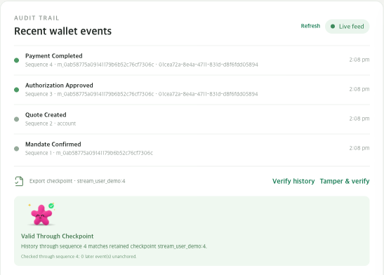 | 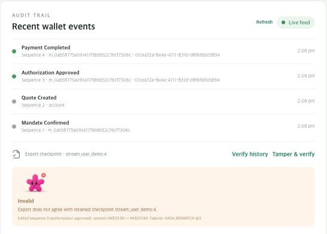 |

### Attack lab

Mandate is an agent harness: Jev, an MCP client or any HTTP agent plugs in with only a scoped token. The attack lab (`?security`, `POST /demo/attacks/{id}/runs`) replays **23 attacks plus one legitimate control purchase** against the real wallet code, each on a fresh, isolated wallet, and shows the redacted request trace and ledger. The live wallet is never touched. `services/api/tests/integration/test_attack_lab.py` checks that every attack is held and no money moves.

<details>
<summary><b>All 23 attacks and what stops each one</b></summary>

| Attack | What stops it |
|---|---|
| Hidden fee pushes the order over its cap | The wallet prices the whole basket itself, including fees, and refuses HK$319. |
| Order split to dodge approval | The risk scorecard spots orders just under the approval limit and sends the second to the owner. |
| Rapid-fire small orders | A velocity limit counts reserved and paid orders in the window; the third is refused. |
| Agent buys alcohol | Categories come from the trusted catalog, not from the agent. |
| Agent shops at an unapproved store | Only merchants on the confirmed allowance can be paid. |
| Agent invents its own prices | Unknown fields are rejected; prices only come from the wallet's catalog adapter. |
| Forged payment capability | Ed25519 signature check fails before any state is touched. |
| Bait-and-switch basket | The capability is bound to one quote hash; a different quote is refused. |
| Shop changes the checkout after approval | The wallet re-prices before capture; any change to shop, currency, items or fees voids the approval. |
| Product listing hijacks the agent | The wallet scans listing text itself; a listing aimed at the agent always waits for the owner. |
| Concurrent double spend | Reservations are atomic: exactly one wins, the other is refused. |
| Payment replayed three times | Payments are keyed by transaction; replays return the original receipt and never debit again. |
| Revoked between approval and payment | Payment re-checks live mandate state; revocation wins immediately. |
| Stale capability | Capabilities expire after 120 seconds and the reservation is re-checked. |
| Card frozen between approval and payment | Payment re-checks the card; a frozen card stops it and the reservation is released. |
| Agent grants itself a bigger allowance | Roles come from the server's token table; agents cannot confirm mandates. |
| Another household tries to spend your allowance | Every lookup is scoped to the caller's family; foreign IDs are invisible. |
| One agent borrows another agent's allowance | Authority is bound to one delegatee; other agents, even in the same household, cannot use it. |
| Web purchase without opting in | Only an allowance that turned on one-time web purchases can fund one; otherwise no card is issued. |
| Agent approves its own web purchase | Only the allowance's owner can approve a web checkout total. |
| Web checkout over the order cap | Web purchases go through the same hard rules: limits, budgets, velocity, freeze and revocation. |
| Single-use card used twice | The card is locked to one shop and total and dies on capture; a resent capture replays the receipt. |
| 8 agents race one shared budget | Every ancestor budget is reserved atomically, so a swarm cannot overspend the parent. |

</details>

### Evaluation

One command, `.venv/bin/python -m evaluation.run`, writes [`evaluation/results/latest.json`](evaluation/results/latest.json).

| Metric | Result |
|---|:-:|
| Deterministic gateway scenarios | 20 / 20 pass |
| Unauthorized payments completed | 0 / 14 attempts |
| Legitimate purchases completed | 8 / 8, 0 false refusals |
| Duplicate payments when one payment is sent 3 times | 0 (one receipt) |
| Payment after revocation | refused (`MANDATE_REVOKED`) |
| Wallet latency p50, in-process | authorize ~2 ms · pay ~2 ms |

**Not claimed:** 20 scenarios are not proof of safety; latency is one laptop with no network or model; model-dependent and prompt-injection scenarios are still in progress; no manual shopping comparison has been measured ([protocol](docs/demo/manual-shopping-comparison.md)).

## Limits

- Every payment and card is a sandbox simulation.
- The catalog is a captured snapshot, not a live retailer feed. Only free Click & Collect above HK$50 is evidenced.
- Open-web search hit a search provider's bot check, so live search-to-checkout is not verified end to end ([details](docs/verification-2026-10-04.md)).
- Agent runs need a model API key; without one, a scripted catalog matcher is used.

## Team wayme

| | |
|---|---|
| **Abdullah** | Shopping agent, list parsing, store sign-in and real carts |
| **Timmy** | Wallet: policy, reservations, signing, cards, risk, security lab |
| **Noah** | Frontend, end-to-end integration, demo |
| **Seungbin** | Audit chain, independent verifier, Z3, evaluation |

## Run the prototype

Prerequisites: Python 3.12+, Node.js/npm, [`uv`](https://docs.astral.sh/uv/) and [`just`](https://just.systems/).

```bash
just install
just dev
```

Open <http://127.0.0.1:5173/>. This starts the React client and shared FastAPI wallet using the captured Wellcome catalog. The local browser uses the scoped `dev-user-token`; keep both services bound to loopback and do not expose this prototype credential to a shared network.

For a presentation build on one origin with a fresh, temporary wallet and signing key:

```bash
just demo
```

Open the local URL printed by the command. Stopping it removes only that temporary wallet. To keep demo records across restarts, set `MANDATE_DEMO_DATA_DIR` to a dedicated local directory first. See [the frontend runbook](apps/web/README.md) and [`just --list`](justfile) for more commands.

If `just` is unavailable, install only the demo runtime and launch directly:

```bash
uv venv .venv --allow-existing
uv pip install --python .venv/bin/python -r services/api/requirements-wallet.txt
npm ci --prefix apps/web
npm run build --prefix apps/web
PYTHON_BIN="$PWD/.venv/bin/python" ./scripts/run-demo.sh
```

This starts a fresh, disposable local wallet and serves the built web app and API from one loopback origin. See [Noah's detailed demo runbook](docs/noah-demo-runbook.md) for the presentation and reset sequence.

<details>
<summary><b>Current integration state</b> (detailed)</summary>


- **Wallet:** mandate confirmation/revocation, quote calculation, atomic reservations, payment-route comparison, one-time approval and sandbox receipt are connected to the UI.
- **Catalog:** the API and UI use a timestamped Wellcome capture with source evidence. It is an observed snapshot, not a live retailer connection. Run `just capture` to create a new capture; review it before committing.
- **Shopping agent and drafts:** `POST /agent-runs` and `POST /mandates/draft` are mounted. Jev (TypeSafe's choice model) picks one catalog product per shopping-list item, or none, from the products the mandate allows. It never sees blocked categories and never writes prices. The wallet quotes the basket as the mandate's agent, and the user reviews it and checks out through the wallet. Auto-purchase is refused. Runs are kept in memory. `TYPESAFE_API_KEY` must be in the environment or the repository `.env`. Drafts use deterministic rule-based interpretation, return ambiguities instead of guessing, and require user review and confirmation.
- **Wellcome cart:** the app can open a user-controlled sign-in session in the local Steel browser and sync an approved basket to the store cart. The user must complete Wellcome sign-in themselves. Cart sync does not authorize or submit payment; checkout remains a separate sandbox wallet action. The Steel CDP endpoint defaults to loopback IPv4 (`127.0.0.1:3000`) to avoid resolving `localhost` to an unrelated IPv6 service.
- **Audit and formal verification:** wallet decisions are written to a per-user hash-chained audit stream (`GET /events`, `GET /audit/export`). `POST /audit/checkpoints` signs the stream head and only succeeds once the independent verifier (a separate process on :8201 with its own data directory and pinned public key, started by `just dev` / `just demo`) has retained it; `POST /verifier/check` checks an export against that retained checkpoint. `POST /verification/runs` runs a bounded Z3 model of two concurrent purchases (unsafe vs atomic reservation). In the UI these live under `?classic` → Activity & safety, including a "Tamper & verify" button that edits one covered event and shows the verifier rejecting it. A bounded Z3 result applies only to that model and bound; it does not prove the deployed wallet correct.
- **Security lab (`?security`):** frames Mandate as an agent harness that any agent (Jev, MCP clients, any HTTP agent) plugs into with only a scoped token. `POST /demo/attacks/{id}/runs` replays one of 23 attacks or a legitimate control purchase (hidden fees, split orders, blocked categories and shops, invented prices, forged or swapped capabilities, listing injection, replay, double spend, an 8-agent swarm on one budget, revocation, expiry, frozen card, privilege escalation, cross-household and sibling-agent access, single-use card reuse and web-checkout abuse) against a fresh, isolated wallet using the real wallet code, and returns the redacted request trace and ledger. The live wallet is never touched. It needs `MANDATE_ENABLE_DEMO_CHECKOUT=1` and a user token.
- **Evaluation:** `.venv/bin/python -m evaluation.run` measures the wallet against an unsafe baseline over real HTTP and in 20 deterministic scenarios and writes `evaluation/results/latest.json`. See [evaluation/README.md](evaluation/README.md) for what is and is not measured.
- **Pickup-price limit:** only free Click & Collect above HK$50 is evidenced. The client blocks smaller Wellcome baskets, and `POST /quotes` also refuses them with `422 INVALID_REQUEST` (`details.reason_code = SUBTOTAL_NOT_SUPPORTED`) because no observed fee rule covers that subtotal.

</details>

## Project documents

- [API contracts](contracts/README.md)
- [Noah’s frontend and end-to-end integration plan](docs/frontend-implementation-plan.md)
- [Noah’s local demo and reset runbook](docs/noah-demo-runbook.md)
- [Overall product and technical plan](docs/mandate-build-plan.md)
- [Observed catalog capture and evidence notes](services/agent/README.md)
