# Noah — Frontend and End-to-End Integration Plan

**Project:** Mandate / HacKU 2026
**Owner:** Noah
**Baseline inspected:** `main` at `0468327` on 2 October 2026
**Goal:** an integrated first version on Saturday morning; submission freeze Sunday, 4 October, 13:00 Asia/Hong_Kong
**Status (3 October 2026, main `e346205`):** Noah-owned frontend and shared-app integration is connected to the merged wallet, typed/voice shopping-list flow, audit/checkpoint/verifier services and Z3 model. The current one-screen experience links to the full dashboard and Safety Lab. The 390px browser flow, sandbox checkout/refusal/revocation, live audit checkpoint and tamper detection, Z3 variants, and opt-in unusual-purchase approval have been exercised. No real funds move. The API enforces observed pickup-fee coverage and rejects agent requests that weaken mandate constraints. A second physical-machine rehearsal is still outstanding; Seungbin PR #12 is an open WIP evaluation extension and its model-dependent scenarios are not part of the current `main` integration.

## 1. Product and scope

Build a mobile-friendly caregiver shopping application with a desktop demonstration dashboard. A user confirms a spending mandate, starts a grocery order, sees the chosen basket and total, and receives either a sandbox receipt or a clear refusal. Users can revoke spending permission and inspect why each decision happened.

The technical views show two agents competing for a shared budget, the bounded formal-verification result, and independently checked audit records. These views consume Seungbin's real API outputs or the identified, timestamped evaluation artifact. The UI has contract-backed polling and action handlers for events, audit export/checkpoint/verifier, and unsafe/atomic solver APIs. Product prices and quote delivery charges display their linked evidence IDs as source links with evidence kind and observation date; placeholder or incomplete evidence is labelled unverified and is never linked as a live source.

The initial story is one caregiver delegating weekly groceries. Seungbin proposes one root weekly mandate with two shop-specific child mandates, which fits the current same-owner implementation. Treat this as a proposed demo story until agreed. The current wallet confirmation code requires the parent and child owner to be the same user; do not build a separate-parent-and-student account experience that claims cross-user delegation already works.

Core scope:

1. Explicit mandate confirmation.
2. Grocery basket and server-calculated total, including delivery.
3. Shopping progress and policy decision.
4. Actual sandbox purchase and receipt.
5. Remaining/reserved/spent budget and revocation.
6. Evidence/source inspection and accurate development-data labels.
7. Actual concurrency, bounded-verification and audit results once connected.

Extensions after integration: conversational draft UX, character animation, fridge-photo assistance and WhatsApp. Phone calls, automatic refunds, payment-card issuance and unverified reward recommendations are outside the first version.

## 2. Current repository reality

The repository contains the React/Vite client, shared FastAPI app, Timmy's wallet, Abdullah's observed Wellcome catalog and draft/shopping-run APIs, and Seungbin's independent audit/verifier/Z3 services. Their routers are mounted by the shared app. External Jev selection still depends on configured credentials and network access; the default one-screen path honestly labels its preset-basket fallback.

| Area | Current state at `e346205` | Consequence for Noah |
|---|---|---|
| Wallet | Timmy's routes, service, models, signing, SQLite storage and sandbox rail are present | Compose and consume wallet APIs; do not reimplement policy or ledger |
| Shared app | `mandate.app:app` mounts wallet, catalog, demo, agent, audit and verification routes, health and the built SPA | Keep this as the single entrypoint and preserve JSON errors for unknown API paths |
| Drafts | Mounted `/mandates/draft` uses deterministic fixed rules and returns ambiguities instead of guessing | Describe as rule-based parsing, not model interpretation; user explicitly confirms rules |
| Quotes | Server calculates catalog totals and hashes | Never manufacture final prices in the browser |
| Agent | Mounted `/agent-runs` calls the Jev selector over allowed catalog products; run state is in memory | Keep manual/preset path and report provider or fallback honestly; runs are lost on API restart |
| Audit | Seungbin's chained events, signed checkpoints and independent verifier are mounted and started by `scripts/run-demo.sh` | Create a retained checkpoint before calling history verified; keep unanchored records distinct |
| Catalog | `GET /catalog` serves the wallet's trusted catalog; `data/catalog/wellcome.json` has captured, timestamped Wellcome evidence | Use the observed snapshot by default, retain the explicit placeholder fallback, and disclose snapshot age/coverage limits |
| Payment rail | Local simulated adapter; no money moves | Receipts and screens clearly say sandbox simulation |
| Risk review | Timmy PR #13 is merged; zero-trust agent policy checks and opt-in unusual-purchase review are available | Expose the opt-in rule and exact review reasons; never imply approval bypasses hard limits |
| Verification/evaluation | Z3 API is mounted; measured HTTP race is bundled from `evaluation/results/latest.json` with source commit/time/delay | Run solver on demand and state its assumptions/bound; label measured data as a recorded evaluation, not a fresh browser race |
| Rubric | Percentages are asserted in Seungbin's proposal; handbook not inspected here | Obtain the source before using those weights to prioritize or claim compliance |

Existing wallet routes:

```text
POST /api/v1/mandates/confirm
GET  /api/v1/mandates/{mandate_id}
POST /api/v1/mandates/{mandate_id}/revoke
POST /api/v1/quotes
GET  /api/v1/quotes/{quote_id}
POST /api/v1/authorizations
POST /api/v1/payments
GET  /api/v1/payments/{transaction_id}
POST /api/v1/reservations/{reservation_id}/cancel
GET  /api/v1/wallet/{mandate_id}
```

The OpenAPI contract also defines draft creation, catalog, agent runs, events, audit and verification operations. Their presence in the specification does not mean their implementation exists.

## 3. Ownership and handoffs

### Noah owns

- `apps/web`: page structure, design, interaction states, API client, client state and presentation.
- Shared API composition: app startup, router mounting, error handlers, health/readiness, local proxy and startup documentation.
- Integration adapters and user-triggered demo orchestration, with explicit contracts and role enforcement.
- Demonstration scenario controls, deterministic reset lifecycle, screenshots/video and a backup run.
- Presentation of evidence, refusal reasons, bounded verification and audit outcomes.

### Teammates own

- **Abdullah:** draft interpretation and lookup, agent runs, basket selection, model metadata, observed catalog data and catalog endpoint.
- **Timmy:** policy, quotes, financial transitions, credentials/signing, reservations, payment and revocation. Owns storage migrations for his tables.
- **Seungbin:** audit append/signing/retention/verifier, Z3 models, concurrent API evaluation, manual comparison and result data.

Noah connects their modules rather than editing their policy, model or verification algorithms. Shared-router registration and proposed additional endpoints require agreement in `contracts/` first.

## 4. Application architecture

Use React + TypeScript + Vite with a small CSS token system. Import the existing `contracts/types.ts`; regenerate when the public schema changes. Keep data access in a typed API layer and domain state in feature hooks/reducers. Avoid introducing a large component library or a second backend framework before the first transaction works.

During development, Vite proxies `/api` to the local FastAPI service, preserving `/api/v1`. The frontend uses relative API URLs. This avoids a separate cross-origin configuration for the first local run. For a packaged demo, the shared FastAPI app serves built assets and API from one origin. The SPA fallback excludes unknown API paths so they remain JSON errors.

The shared API entrypoint should reuse:

```python
app.include_router(build_router(wallet), prefix="/api/v1")
install_error_handlers(app)
```

Construct the wallet through its documented dependencies and expose a draft-lookup integration seam for Abdullah. Timmy's `dev_app.create_app` is the current reference. Do not copy his service implementation into Noah's module.

Browser code must never contain the agent credential, authorization signing key or a selectable arbitrary actor identity. Purchase execution belongs in Abdullah's worker. Until that worker exists, any local demo orchestration lives on the server, is user-authenticated and demo-gated, and selects only the configured agent assigned to the current user's mandate. It calls the existing wallet logic without bypassing its policy checks. Do not make a general user-to-agent impersonation proxy.

## 5. Screen design and behavior

Use a clear, friendly product interface. Mobile width is the main user flow; desktop adds an evidence sidebar. A character is an optional status indicator attached to real events, not a substitute for readable decisions.

### A. Setup and readiness

Purpose: make the demo's real mode and dependencies obvious.

- Show backend connectivity, agent provider/mode, payment sandbox and catalog quality.
- Explicitly identify placeholder prices and unavailable modules.
- Display last successful refresh time and reconnect action.
- Keep debug/reset controls behind a visible local demo mode.

Do not infer verified data from `data_mode: observed_snapshot`: the current fixture uses that value despite its placeholder warning. Require explicit source/evidence checks before presenting compliant observed data.

### B. Create and confirm mandate

- Natural-language request input when Abdullah's endpoint is available.
- Structured review of per-order and period caps, merchants, blocked categories, expiry and optional approval threshold.
- Clarifying question when period, merchant or expiry is ambiguous.
- Explicit confirmation action; show the returned active mandate/version.
- Seeded-template path for the first version, prominently labeled, using a registered server draft.
- Readable “May do / Requires review / Cannot do” summary based on persisted policy.

Formatting in the interface is not authority. The backend decides validity and narrowing. Do not turn a policy draft into an active mandate in client state before confirmation succeeds.

### C. Shopping and basket

- Grocery list input, quantities and supported units.
- Agent progress with actual provider name and local/cloud/scripted mode.
- Candidate comparison based on returned products/quotes, clearly scoped to supported offers.
- Final basket rows, quantities, subtotal, delivery charges and total.
- Source/evidence links and applicability conditions.
- Quote expiry and stale-quote handling.

If the agent is unavailable, a developer adapter may select known catalog product IDs and call the real quote service. Label it scripted. It must not claim intelligent comparison or a live retailer connection.

### D. Decision and checkout

- States for checking policy, authorized/reserved, refused, review required, paying, completed and uncertain result.
- Display affected rule, actual amount and limit from the response.
- Show reservation expiry and refresh budget after financial mutations.
- When the basket changes, discard the old quote/authorization and request new ones.
- Disable accidental duplicate clicks while preserving intentional API retry semantics.
- Provide revoke/cancel controls appropriate to current state.

The browser does not decide that a purchase is safe. A green badge requires a real approved response, and purchase completion requires a real receipt.

### E. Wallet and receipts

- Show paid, reserved and available amounts separately for every applicable budget.
- Distinguish root budget from each child constraint; do not add ancestor and child balances together as if they were independent money.
- Show parent chain, merchant, receipt ID, amount, timestamp and sandbox label.
- A replayed receipt is marked as an existing purchase, not a second success.
- Fetch current mandate and budget after reload using known IDs; do not rely on local cache as financial truth.

### F. Evidence, audit and verification

- Human-readable event feed with cursor-based polling and deduplication.
- Rule/source detail drawer, including policy version and relevant quote.
- Audit export, previously retained checkpoint reference and verifier result.
- Separate structurally valid but unanchored history from checkpoint-covered history.
- Safety Lab with actual concurrent API outcomes beside the formal counterexample.
- Display bounds, assumptions, runtime and inconclusive status for Z3.
- Evaluation view reads Seungbin's measured file/schema after agreement; until then show not available.

If a module is unavailable, show that honestly. Never render “verified,” “zero violations” or a completed refund as an illustrative success.

## 6. State management and recovery

```mermaid
stateDiagram-v2
    [*] --> Draft
    Draft --> Active: user confirms; server succeeds
    Active --> Quoted: authoritative quote
    Quoted --> Reserved: authorization approved
    Quoted --> Refused: policy refuses
    Quoted --> Review: user input required
    Reserved --> Paid: payment receipt
    Reserved --> Cancelled: cancel/revoke commits
    Reserved --> Expired: server expiry
    Reserved --> Uncertain: network response lost
    Uncertain --> Paid: receipt reconciliation
    Uncertain --> Reserved: server confirms still pending
    Refused --> Quoted: new basket and transaction
    Review --> Quoted: permitted new input/authority
```



Server responses drive transitions. Merely closing a browser dialog or aborting a network request does not cancel a reservation or payment.

Store a stable transaction ID and idempotency key per semantic operation before submission. A network retry keeps the same key and request. A changed basket or fresh attempt uses new identifiers. Do not regenerate them on each React render.

After a payment timeout, retrieve its receipt by transaction ID and reconcile. A 404 alone does not prove the original request cannot still commit; use a controlled same-key retry or authoritative worker status. Never send a new transaction to “try again” before resolving an uncertain payment.

Use server expiry timestamps for countdowns, treating client time only as presentation. Poll the active run/budget/events while needed, stop polling on unmount, and refresh on reconnection. Out-of-order responses cannot overwrite newer run or ledger state.

Keep HTTP errors distinct from business refusals. A 200 response with `status: refused` becomes a policy decision view. A 401/403/409/422/503 becomes the appropriate error/retry behavior, retaining existing authoritative financial state.

## 7. API integration sequence

| Stage | Wire first | Depend on | Exit criterion |
|---|---|---|---|
| 1 | Existing wallet local app + typed fetch layer | Timmy router/auth/error envelope | UI fetches real mandate/quote/budget without inventing data |
| 2 | Seeded mandate confirmation + quote display | Registered draft and catalog fixture | Confirmed mandate and server total visible |
| 3 | Server-owned purchase execution | Abdullah worker or agreed demo adapter | One real sandbox receipt and updated budgets |
| 4 | Refusal, cancel and revoke | Wallet response semantics | Over-budget order cannot pay; revoked reservation cannot pay |
| 5 | Real draft and run APIs | Abdullah modules | Replace development adapters without changing screen flow |
| 6 | Ordered events and export | Seungbin audit module | Real decision history and policy snapshot visible |
| 7 | Concurrency and Z3 | Seungbin evaluation/model | Actual outcomes, counterexample and bounded result visible |
| 8 | Independent verifier and evidence dataset | Seungbin verifier; Abdullah observations | Anchored tamper check and source-backed monetary values ready |

Do not block all UI work on stages 5–8. Development adapters live behind one boundary and are never mixed silently with real results.

## 8. Proposed module layout

```text
apps/web/
  src/app/                    # routing, layout, readiness
  src/components/             # accessible reusable controls
  src/features/mandate/       # draft/review/confirm
  src/features/shopping/      # list, run feed, candidate basket
  src/features/wallet/        # budgets, decisions, revoke, receipt
  src/features/audit/         # events, export, checkpoint verification UI
  src/features/safety-lab/    # concurrency + bounded-model presentation
  src/features/demo/          # scenario controls and reset UI
  src/lib/api/                # typed fetch, errors, idempotency helpers
  src/lib/format/             # HKD, time, policy labels
  src/dev/                    # explicitly scripted development adapters
services/api/mandate/
  app.py                      # Noah: shared composition entrypoint
  integration/                # Noah: narrowly scoped adapters/demo orchestration
  agent/                      # Abdullah
  payments/                   # Timmy
  storage/                    # owner by table/migration agreement
  audit/                      # Seungbin
verification/                 # Seungbin
evaluation/                   # Seungbin
contracts/                    # agreed public contracts
scripts/                      # Noah: startup and demo coordination
```

This layout is proposed; choose the shared entrypoint once and avoid parallel edits to it. Folder separation does not replace agreement on process ownership, database transactions and interfaces.

## 9. Delivery sequence and time targets

Targets are Hong Kong time. Saturday morning is the team-agreed first-version window; **10:00 on 3 October is a proposed integration checkpoint**, not a new organizer deadline.

### First 60–90 minutes of implementation

1. Sync main, inspect any new teammate commits and record changed integration assumptions.
2. Create the web shell, basic visual tokens and typed API client.
3. Agree shared app composition and user/agent credential boundary with Timmy/Abdullah.
4. Connect the wallet router and show backend readiness.

### Tonight: first end-to-end path

1. Confirm seeded policy through the actual backend.
2. Request and display an actual sandbox quote.
3. Invoke server-owned agent execution and receive authorization/payment outcomes.
4. Display receipt, paid/reserved/available amounts and one budget refusal.
5. Commit a working checkpoint before optional visual features.

### Saturday morning: integrated v0

1. Replace seed-only paths with Abdullah's draft/run APIs if ready.
2. Add revoke, retry/replay and stale-quote UX.
3. Connect Seungbin's live events if ready; otherwise distinguish audit stub/unavailable mode.
4. Ensure the mobile-width flow works and collect first full demonstration recording.
5. Handoff any source-data gap to the catalog/evidence owner; retain visible development labels until fixed.

### Saturday afternoon

1. Add the real two-agent concurrency scene once Seungbin's runner is ready.
2. Add readable conflict/violation timeline and rule details.
3. Integrate measured manual comparison and source-backed prices/fees.
4. Prepare the supported payment-rail explanation from verified sources; show the implemented simulator accurately.

### Saturday evening

1. Integrate bounded Z3 results and independent audit verifier.
2. Freeze the demonstration sequence and shared contracts except necessary fixes.
3. Add character states only if core flows and evidence are stable.
4. Rehearse on the main and backup machines; record a backup.

### Sunday before submission

1. Sync agreed final changes, run targeted acceptance checks and rehearse from a clean seed.
2. Finalize README/start commands, configuration template, video and presentation screenshots.
3. Reserve roughly the last hour before 13:00 for submission and fixes; do not introduce architecture changes.

If an external module misses a handoff, retain an explicitly labeled development mode and prioritise the complete genuine wallet transaction. Document missing capability rather than showing a fabricated passing demonstration.

## 10. Meaningful verification plan

Tests here are planned acceptance checks, not results already achieved.

- Successful policy confirmation, quote, actual sandbox receipt and ledger refresh.
- An over-budget basket shows the real refusal and never shows paid.
- Agent-only payment endpoints cannot be invoked with the user credential.
- Two purchase attempts competing for one remaining budget cannot both complete.
- Double-click, retry and reload do not create duplicate payments.
- Revocation before payment blocks it; already completed purchase stays completed.
- Changing a basket invalidates old authorization.
- Timeout UI does not imply failure or issue a new transaction prematurely.
- Placeholder observations never receive a verified-data badge.
- Formal timeout/unknown displays inconclusive; verifier without checkpoint does not show pass.
- Mobile-width keyboard flow, readable contrast, accessible labels and non-color status text.
- UI events and displayed receipts/amounts agree with exported backend records.

Use component tests for consequential state/error behavior and browser checks for complete flows; coordinate domain tests with Seungbin instead of duplicating his suite. Run Timmy's existing suite when composing the shared app or changing integration assumptions, not simply to claim tests have been run.

## 11. Demonstration script

Prepare one action per scene with clear state reset and backend evidence.

1. **Delegate:** mobile view shows the caregiver's confirmed rules.
2. **Shop:** agent chooses a supported basket; show final total and sources.
3. **Complete:** real simulator produces receipt and wallet updates.
4. **Hold the boundary:** second basket fails the actual order cap with applicable observed delivery charge.
5. **Concurrent agents:** root budget has only enough for one purchase; actual requests show one reservation succeeding.
6. **Revoke:** pause after authorization, revoke, then show rejected payment.
7. **Inspect:** event record identifies the policy/rule and receipt.
8. **Verify:** altered anchored audit export fails independently; bounded-model result shows scope.

The headline is safe, understandable grocery delegation. Deep technical views answer follow-up questions without burying the user journey. Every simulated element, model fallback and unimplemented external rail is identified accurately.

## 12. Repository synchronization rules

Before each work session and at integration checkpoints, inspect local status and fetch the current remote. Pull using fast-forward only when the checkout is clean and the branch relationship allows it. Read changes to contracts, teammate modules and docs before continuing.

Never auto-stash, reset, force-push or overwrite local work to achieve synchronization. If local changes or divergence block a safe pull, inspect the incoming diff, preserve work and reconcile deliberately. Recheck remote before a push; handle a concurrent push through a normal merge/rebase process appropriate to the branch, never force.

This rule is for active work sessions. There is no background polling job or unattended pull process installed by this plan. Team members still need to commit, integrate and communicate contract changes.

## 13. Definition of done for Noah

- A clean local checkout can start the web application and shared API using documented commands.
- The caregiver can confirm authority, shop and inspect one actual sandbox result.
- Budget/refusal/revocation views are driven by backend truth.
- Agent, wallet, audit and verification modules have explicit, functioning integration boundaries.
- Financial credentials remain outside browser code and logs.
- Placeholder data and simulation labels are correct; demonstrated financial values have source evidence.
- Evidence and safety views show measured/verified results with their limits.
- Main and backup demonstrations can restart from known seed state.
- Changes are committed and pushed with team-facing handoff notes and the shared contract kept consistent.

## 14. Integration checkpoint — 3 October 2026

> Historical checkpoint written before Abdullah PR #8 and Seungbin PRs #9 and #11 were merged. Its remaining-dependency statements are superseded by the current checkpoint in §15.

The wallet exposes payment-route comparisons, one-time approval requests, refunds and velocity limits. The web client integrates the quote-specific route picker, owner approve/decline actions, and an explicit continuation action for an approval that succeeded before a client/network failure. The demo purchase adapter resumes only the matching transaction after checking that its approval is approved; the wallet still reevaluates policy and budget before payment.

The mandate review now exposes the approval threshold and purchase-frequency limit, and the wallet view reads those values from the confirmed policy. The demo request contract carries an optional route ID and approval ID. The browser still receives no signed authorization token or payment credential.

The shared API composition is mounted. The local production build and the actual browser flow have been checked: the server returned the captured 80-product Wellcome catalog, the user confirmed an HK$800 weekly / HK$300 per-order mandate, the wallet quoted an HK$100.90 basket with its captured item and pickup evidence, the route picker showed three server-ranked options, and the sandbox produced a receipt and updated budget. No real funds moved. The focused local sandbox data is temporary and should be removed after the run.

Noah's local run/reset commands and concise presentation runbook are documented. Continue fetching the team branch at each integration checkpoint and reconnect new teammate modules only after reviewing their contracts and code. Remaining external dependencies: Abdullah's live draft and shopping-run APIs; Timmy's server-side rejection for unsupported Wellcome pickup subtotals; Seungbin's audit/verifier/Z3 and measured concurrency/evaluation APIs. The frontend must keep these visibly unavailable until their actual results are connected. Payment route choices are suggestions: at authorization the wallet checks the selected route against its current eligibility and persists that route on the reservation, which the payment operation then uses. Checkout uncertainty must preserve the transaction ID and reconcile an existing receipt; a `409` conflict is not treated as proof that no payment occurred.

The documented `scripts/run-demo.sh` launcher was rehearsed from a clean temporary ledger in the browser: structured mandate confirmation, observed catalog quote, wallet-ranked payment route, sandbox receipt and refreshed budget all completed. A separate sandbox pass showed the alcohol rule refusal and that a revoked mandate cannot authorize a new purchase. An approval-gated UI run confirmed that a basket pauses for the owner's one-time approval, then completes under the same transaction; the stale review prompt disappears when its receipt arrives. The UI-facing checkout response was tightened to omit both the signed authorization token and one-time payment credential; the response was inspected after purchase and neither secret was present. Stopping the documented launcher removed its temporary demo directories. Frontend production build and generated OpenAPI TypeScript types were verified after the response-contract change.

A further clean-ledger browser run confirmed that starting a new agent order clears the prior receipt/refusal/uncertain result from the active order panel. The agent endpoint returned the expected 404 in this checkout; the old receipt remained a wallet record and was not shown as the new order's outcome. The production build passed after this UI-state fix.

The clean-ledger browser run also rechecked the refusal and revocation scenes: a HK$51 captured alcohol item received a wallet quote but checkout returned the `blocked_categories` refusal without a receipt; revoking the active mandate returned success, updated its state to revoked, and disabled agent, quantity and quote actions in the shopping view. The 404 event endpoint continued to appear as “Not connected,” not an empty verified feed.

On 3 October, a fresh single-origin demo ledger was exercised through the shared API: the captured 80-product catalog loaded; the seeded mandate confirmed; a timestamped Wellcome pantry item was quoted at HK$89.90; wallet-ranked payment options loaded; and the local sandbox returned a receipt. A captured alcohol item was refused with `CATEGORY_BLOCKED` and no receipt. After revocation, a fresh valid-item quote was refused with `MANDATE_REVOKED` and no receipt. The demo process was stopped afterward, removing its temporary ledger. This API-level rehearsal was followed by the separate mobile browser rehearsal below.

A separate 390×844 browser rehearsal used the actual web UI: it confirmed the sample mandate, quoted the default HK$100.90 basket, completed its sandbox receipt, refused a fresh HK$51 Blue Girl beer basket, and revoked spending access. The first pass exposed that product quantity buttons stayed enabled after revocation even though quote and agent actions were already blocked. `ProductRow` now disables both quantity controls whenever the mandate is inactive. After rebuilding and reloading against the revoked wallet, all 160 quantity controls, the quote action and agent submit were disabled; the document width remained 390px. The backup-machine rehearsal remains outstanding.

A further 390×844 responsive sweep checked Overview, Shopping, Family wallet and Activity & safety; each reported a 390px document width with no horizontal overflow. The mandate-review dialog has a 812px scroll viewport for 990px of content, and scrolling to the bottom places **Activate these rules** fully inside the dialog and screen.

A 25.6-second screen recording was added at `docs/demo/mandate-demo.mp4` and linked from Noah’s runbook. It shows mandate activation, the HK$100.90 local sandbox receipt, the actual alcohol-policy refusal, revocation, and the honest disconnected activity view. The MP4 uses H.264/yuv420p at 1440×1000; it moves no real money. The backup-machine rehearsal and teammate-owned agent, route-enforcement, audit, and verification endpoints remain outstanding.

When the agent-run endpoint is unavailable, the web app now presents an opt-in local scripted catalog matcher. It accepts exact available product titles only, rejects unmatched or ambiguous lines and clears the prior cart/checkout so stale items cannot be purchased; quote creation and policy enforcement stay with the wallet. The UI says no AI was used. This fulfills the planned developer-adapter fallback without claiming the teammate-owned shopping agent is connected.

The opt-in scripted fallback was exercised in the browser against a clean local wallet: the absent `POST /agent-runs` endpoint returned 404, exact matches for the two prefilled catalog titles populated the basket, and the wallet returned an HK$100.90 quote. Attempting a new scripted match clears the old checkout first; an unmatched partial title then emptied the previous cart and was rejected without generating a replacement quote. At a 390px viewport, the fallback controls stayed within the viewport (document width 390px). The production frontend build passed after this change.

The pushed fallback commit `81ae821` was rechecked from a disposable clean checkout: `npm ci`, the production frontend build, a new Python 3.12 virtual environment, and wallet requirements installation all completed. `scripts/run-demo.sh` then served the homepage, `/api/v1/health`, and the authenticated 80-product catalog with HTTP 200; `/api/v1/agent-runs` returned the expected 404. The demo server was stopped and the temporary checkout removed.

## 15. Integrated team services — 3 October 2026

GitHub `main` was synchronized before review and advanced through Seungbin PR #9 (`68039a2`) and PR #11 (`608af4f`). The latest teammate work was checked first in a disposable worktree based on `origin/seungbin/race-view`; no OpenAPI/type contract changes were included. PR #9 adds the event feed, signed checkpoints, independent verifier and bounded Z3 endpoint. PR #11 adds the recorded HTTP-race comparison to the classic Safety Lab and serializes concurrent Z3 calls to avoid the reported Z3 global-context crash. PR #12 remains an open WIP and is not merged.

Validation on the disposable integration tree: `npm run build` passed; all 108 `services/api/tests` passed; all 3 `evaluation/tests` passed. The evaluation harness expects `services/api/.venv/bin/python`, so its test run mapped that repo-local path to the isolated Python 3.12 environment. The one-origin demo returned HTTP 200 for the SPA, health, authenticated 80-product catalog and Z3 endpoint.

The visible browser flow was rehearsed at 390px against an ephemeral wallet: mandate activation, preset basket fallback when Jev credentials are absent, HK$151.80 sandbox receipt and refreshed HK$648.20 balance. The default one-screen UI exposes the classic dashboard through **How this works → Open the full dashboard**. The full dashboard showed the four real wallet events; checkpoint creation and ordinary verification returned **valid through checkpoint**; tamper-and-verify returned **HASH_MISMATCH** at the edited event; the Z3 endpoint returned an unsafe counterexample and an atomic **no counterexample within bound** result; the measured HTTP panel showed the captured evaluation outcomes and clearly stated its artificial unsafe-baseline delay. No real payment was made.

Updated runbook/recording notes now distinguish the current connected prototype from the older 25.6-second recording, which predates the agent and audit integrations. Remaining Noah-owned item: rehearse reset/start and the same user-visible path on a second physical machine, then refresh the recording if useful. That hardware action cannot be verified from the current machine.


## 16. Risk review integration — 3 October 2026

After a fresh fetch, Timmy PR #13 was merged into `main` as `3ce69f2`. It adds zero-trust validation of agent requests against the confirmed mandate and a wallet-owned unusual-purchase review rule. The agent cannot relax the mandate; the wallet remains authoritative. The optional rule can pause qualifying purchases for the owner's one-time review, while hard policy violations remain refusals.

Noah's UI now exposes **Review unusual purchases** in both the one-screen and classic mandate setup. The setting is included in the confirmed policy and shown in the simple wallet summary. An approval-pending screen explains that no funds are reserved or paid, lists the exact reasons, and makes clear that approval applies once to this basket and reason set.

The Vite production build passed after the UI integration and all 157 API tests passed after the latest team sync. A live browser flow enabled the rule, activated a mandate, quoted the preset basket because Jev was not configured, and showed the first-purchase reason. Nothing was paid while pending. Selecting **Approve once** completed the same sandbox transaction for HK$151.80 and updated the remaining budget to HK$648.20. No real funds moved.

At the next sync, GitHub `main` added shopping-list input and voice transcription (PR #15) plus first-purchase-from-a-new-shop review (PR #16). The simple UI now accepts typed lists and recorded speech; local faster-whisper transcribes audio, and the parser uses OpenRouter with a transparent fixed-rule fallback. The agent still selects from the bounded catalog and the wallet still prices and enforces the mandate. The risk review history now includes shop identity, and the UI displays all reasons supplied by the wallet. These changes were merged locally with the risk-review UI as `4fd35df`. The Vite build passed and all 157 API tests passed after the sync. No live external-model or microphone round-trip was exercised in this validation. Timmy PR #14 remains an optional open webhook proposal; Seungbin PR #12 remains WIP. The second physical-machine rehearsal is still outstanding.


## 17. Clean setup and integration readiness — 3 October 2026

A fresh `git fetch origin` found no commits beyond `e346205`; local `main` matched `origin/main`. The current one-origin demo was rebuilt and started through `scripts/run-demo.sh` with a newly installed repository virtual environment. The SPA and assets loaded in the browser, and `/api/v1/health` and `/api/v1/catalog` returned HTTP 200. The demo was stopped normally and its ephemeral payment ledger was removed. This verifies setup and restart on this Mac; it does not substitute for rehearsal on a second physical machine.

This Mac does not have the `just` executable. The documented direct setup fallback was run instead: Python requirements installed with `uv`, `npm ci` completed with no reported vulnerabilities, and the Vite production build passed. The full repository test recipe also passed: API 157, MCP wallet 5, and agent 30 tests. The only warnings were the existing Starlette/httpx TestClient deprecation notices.

The integrated source under this checkpoint is `e346205`. The existing reactivation regression test also passes: after freezing an allowance, the UI obtains a new draft and can activate a distinct allowance. The only remaining Noah definition-of-done item requiring a different device is the backup-machine start/reset and user-visible demo rehearsal.
