# Noah — Frontend and End-to-End Integration Plan

**Project:** Mandate / HacKU 2026
**Owner:** Noah
**Baseline inspected:** `main` at `0468327` on 2 October 2026
**Goal:** an integrated first version on Saturday morning; submission freeze Sunday, 4 October, 13:00 Asia/Hong_Kong
**Status:** implementation in progress. The React/Vite UI, typed wallet client, shared FastAPI entrypoint, health route and gated local checkout adapter are implemented. Abdullah’s catalog/agent-run service and Seungbin’s audit/verifier/Z3 services remain unintegrated in the current checkout; the UI marks those limits explicitly.

## 1. Product and scope

Build a mobile-friendly caregiver shopping application with a desktop demonstration dashboard. A user confirms a spending mandate, starts a grocery order, sees the chosen basket and total, and receives either a sandbox receipt or a clear refusal. Users can revoke spending permission and inspect why each decision happened.

The technical views show two agents competing for a shared budget, the bounded formal-verification result, and independently checked audit records. These views consume Timmy's and Seungbin's real outputs. The UI now has contract-backed polling and action handlers for event, audit export/checkpoint/verifier, and unsafe/atomic solver APIs; the current checkout still returns unavailable for the teammate-owned endpoints.

The initial story is one caregiver delegating weekly groceries. Seungbin proposes one root weekly mandate with two shop-specific child mandates, which fits the current same-owner implementation. Treat this as a proposed demo story until agreed. The current wallet confirmation code requires the parent and child owner to be the same user; do not build a separate-parent-and-student account experience that claims cross-user delegation already works.

Core scope:

1. Explicit mandate confirmation.
2. Grocery basket and server-calculated total, including delivery.
3. Shopping progress and policy decision.
4. Actual sandbox purchase and receipt.
5. Remaining/reserved/spent budget and revocation.
6. Evidence/source inspection and accurate development-data labels.
7. Actual concurrency, bounded-verification and audit results once connected.

Extensions after integration: conversational draft UX, character animation, fridge-photo assistance and WhatsApp. Phone calls, automatic refunds, payment-card issuance and unverified reward recommendations are outside the first version.

## 2. Current repository reality

The latest pulled changes include Timmy's wallet implementation and Seungbin's architecture proposal. There is no web app, shared FastAPI entrypoint, agent router or verifier router in the inspected commit.

| Area | Current state | Consequence for Noah |
|---|---|---|
| Wallet | Ten route definitions, service, models, signing, storage and tests exist | Integrate the existing router; do not reimplement policy or ledger |
| Local wallet app | `mandate.payments.dev_app:seeded_app` is available | First integration can use it; later create the shared composition entrypoint |
| Drafts | Internal `InMemoryDrafts`; seeded `draft_demo` | Use a clearly labeled seeded mandate flow while Abdullah builds draft API |
| Quotes | Server calculates catalog totals and hashes | Never manufacture final prices in the browser |
| Agent | No implementation in inspected commit | Use isolated development adapters until Abdullah's run API is available |
| Audit | Wallet shim writes stub events until `mandate.audit` exists | Do not present stub records as independently verified history |
| Catalog | Explicitly unobserved placeholder data | Show a persistent development-data banner; replace before evidence demo |
| Payment rail | Local simulated adapter; no money moves | Receipts and screens clearly say sandbox simulation |
| Verification/evaluation | Proposed, not yet implemented | Render honest not-connected states rather than invented passing results |
| Rubric | Percentages are asserted in Seungbin's proposal; handbook not inspected here | Obtain the source before using those weights to prioritize or claim compliance |

Existing wallet routes:

```text
POST /api/v1/mandates/confirm
GET  /api/v1/mandates/{mandate_id}
POST /api/v1/mandates/{mandate_id}/revoke
POST /api/v1/quotes
GET  /api/v1/quotes/{quote_id}
POST /api/v1/authorizations
POST /api/v1/payments
GET  /api/v1/payments/{transaction_id}
POST /api/v1/reservations/{reservation_id}/cancel
GET  /api/v1/wallet/{mandate_id}
```

The OpenAPI contract also defines draft creation, catalog, agent runs, events, audit and verification operations. Their presence in the specification does not mean their implementation exists.

## 3. Ownership and handoffs

### Noah owns

- `apps/web`: page structure, design, interaction states, API client, client state and presentation.
- Shared API composition: app startup, router mounting, error handlers, health/readiness, local proxy and startup documentation.
- Integration adapters and user-triggered demo orchestration, with explicit contracts and role enforcement.
- Demonstration scenario controls, deterministic reset lifecycle, screenshots/video and a backup run.
- Presentation of evidence, refusal reasons, bounded verification and audit outcomes.

### Teammates own

- **Abdullah:** draft interpretation and lookup, agent runs, basket selection, model metadata, observed catalog data and catalog endpoint.
- **Timmy:** policy, quotes, financial transitions, credentials/signing, reservations, payment and revocation. Owns storage migrations for his tables.
- **Seungbin:** audit append/signing/retention/verifier, Z3 models, concurrent API evaluation, manual comparison and result data.

Noah connects their modules rather than editing their policy, model or verification algorithms. Shared-router registration and proposed additional endpoints require agreement in `contracts/` first.

## 4. Application architecture

Use React + TypeScript + Vite with a small CSS token system. Import the existing `contracts/types.ts`; regenerate when the public schema changes. Keep data access in a typed API layer and domain state in feature hooks/reducers. Avoid introducing a large component library or a second backend framework before the first transaction works.

During development, Vite proxies `/api` to the local FastAPI service, preserving `/api/v1`. The frontend uses relative API URLs. This avoids a separate cross-origin configuration for the first local run. For a packaged demo, the shared FastAPI app serves built assets and API from one origin. The SPA fallback excludes unknown API paths so they remain JSON errors.

The shared API entrypoint should reuse:

```python
app.include_router(build_router(wallet), prefix="/api/v1")
install_error_handlers(app)
```

Construct the wallet through its documented dependencies and expose a draft-lookup integration seam for Abdullah. Timmy's `dev_app.create_app` is the current reference. Do not copy his service implementation into Noah's module.

Browser code must never contain the agent credential, authorization signing key or a selectable arbitrary actor identity. Purchase execution belongs in Abdullah's worker. Until that worker exists, any local demo orchestration lives on the server, is user-authenticated and demo-gated, and selects only the configured agent assigned to the current user's mandate. It calls the existing wallet logic without bypassing its policy checks. Do not make a general user-to-agent impersonation proxy.

## 5. Screen design and behavior

Use a clear, friendly product interface. Mobile width is the main user flow; desktop adds an evidence sidebar. A character is an optional status indicator attached to real events, not a substitute for readable decisions.

### A. Setup and readiness

Purpose: make the demo's real mode and dependencies obvious.

- Show backend connectivity, agent provider/mode, payment sandbox and catalog quality.
- Explicitly identify placeholder prices and unavailable modules.
- Display last successful refresh time and reconnect action.
- Keep debug/reset controls behind a visible local demo mode.

Do not infer verified data from `data_mode: observed_snapshot`: the current fixture uses that value despite its placeholder warning. Require explicit source/evidence checks before presenting compliant observed data.

### B. Create and confirm mandate

- Natural-language request input when Abdullah's endpoint is available.
- Structured review of per-order and period caps, merchants, blocked categories, expiry and optional approval threshold.
- Clarifying question when period, merchant or expiry is ambiguous.
- Explicit confirmation action; show the returned active mandate/version.
- Seeded-template path for the first version, prominently labeled, using a registered server draft.
- Readable “May do / Requires review / Cannot do” summary based on persisted policy.

Formatting in the interface is not authority. The backend decides validity and narrowing. Do not turn a policy draft into an active mandate in client state before confirmation succeeds.

### C. Shopping and basket

- Grocery list input, quantities and supported units.
- Agent progress with actual provider name and local/cloud/scripted mode.
- Candidate comparison based on returned products/quotes, clearly scoped to supported offers.
- Final basket rows, quantities, subtotal, delivery charges and total.
- Source/evidence links and applicability conditions.
- Quote expiry and stale-quote handling.

If the agent is unavailable, a developer adapter may select known catalog product IDs and call the real quote service. Label it scripted. It must not claim intelligent comparison or a live retailer connection.

### D. Decision and checkout

- States for checking policy, authorized/reserved, refused, review required, paying, completed and uncertain result.
- Display affected rule, actual amount and limit from the response.
- Show reservation expiry and refresh budget after financial mutations.
- When the basket changes, discard the old quote/authorization and request new ones.
- Disable accidental duplicate clicks while preserving intentional API retry semantics.
- Provide revoke/cancel controls appropriate to current state.

The browser does not decide that a purchase is safe. A green badge requires a real approved response, and purchase completion requires a real receipt.

### E. Wallet and receipts

- Show paid, reserved and available amounts separately for every applicable budget.
- Distinguish root budget from each child constraint; do not add ancestor and child balances together as if they were independent money.
- Show parent chain, merchant, receipt ID, amount, timestamp and sandbox label.
- A replayed receipt is marked as an existing purchase, not a second success.
- Fetch current mandate and budget after reload using known IDs; do not rely on local cache as financial truth.

### F. Evidence, audit and verification

- Human-readable event feed with cursor-based polling and deduplication.
- Rule/source detail drawer, including policy version and relevant quote.
- Audit export, previously retained checkpoint reference and verifier result.
- Separate structurally valid but unanchored history from checkpoint-covered history.
- Safety Lab with actual concurrent API outcomes beside the formal counterexample.
- Display bounds, assumptions, runtime and inconclusive status for Z3.
- Evaluation view reads Seungbin's measured file/schema after agreement; until then show not available.

If a module is unavailable, show that honestly. Never render “verified,” “zero violations” or a completed refund as an illustrative success.

## 6. State management and recovery

```mermaid
stateDiagram-v2
    [*] --> Draft
    Draft --> Active: user confirms; server succeeds
    Active --> Quoted: authoritative quote
    Quoted --> Reserved: authorization approved
    Quoted --> Refused: policy refuses
    Quoted --> Review: user input required
    Reserved --> Paid: payment receipt
    Reserved --> Cancelled: cancel/revoke commits
    Reserved --> Expired: server expiry
    Reserved --> Uncertain: network response lost
    Uncertain --> Paid: receipt reconciliation
    Uncertain --> Reserved: server confirms still pending
    Refused --> Quoted: new basket and transaction
    Review --> Quoted: permitted new input/authority
```



Server responses drive transitions. Merely closing a browser dialog or aborting a network request does not cancel a reservation or payment.

Store a stable transaction ID and idempotency key per semantic operation before submission. A network retry keeps the same key and request. A changed basket or fresh attempt uses new identifiers. Do not regenerate them on each React render.

After a payment timeout, retrieve its receipt by transaction ID and reconcile. A 404 alone does not prove the original request cannot still commit; use a controlled same-key retry or authoritative worker status. Never send a new transaction to “try again” before resolving an uncertain payment.

Use server expiry timestamps for countdowns, treating client time only as presentation. Poll the active run/budget/events while needed, stop polling on unmount, and refresh on reconnection. Out-of-order responses cannot overwrite newer run or ledger state.

Keep HTTP errors distinct from business refusals. A 200 response with `status: refused` becomes a policy decision view. A 401/403/409/422/503 becomes the appropriate error/retry behavior, retaining existing authoritative financial state.

## 7. API integration sequence

| Stage | Wire first | Depend on | Exit criterion |
|---|---|---|---|
| 1 | Existing wallet local app + typed fetch layer | Timmy router/auth/error envelope | UI fetches real mandate/quote/budget without inventing data |
| 2 | Seeded mandate confirmation + quote display | Registered draft and catalog fixture | Confirmed mandate and server total visible |
| 3 | Server-owned purchase execution | Abdullah worker or agreed demo adapter | One real sandbox receipt and updated budgets |
| 4 | Refusal, cancel and revoke | Wallet response semantics | Over-budget order cannot pay; revoked reservation cannot pay |
| 5 | Real draft and run APIs | Abdullah modules | Replace development adapters without changing screen flow |
| 6 | Ordered events and export | Seungbin audit module | Real decision history and policy snapshot visible |
| 7 | Concurrency and Z3 | Seungbin evaluation/model | Actual outcomes, counterexample and bounded result visible |
| 8 | Independent verifier and evidence dataset | Seungbin verifier; Abdullah observations | Anchored tamper check and source-backed monetary values ready |

Do not block all UI work on stages 5–8. Development adapters live behind one boundary and are never mixed silently with real results.

## 8. Proposed module layout

```text
apps/web/
  src/app/                    # routing, layout, readiness
  src/components/             # accessible reusable controls
  src/features/mandate/       # draft/review/confirm
  src/features/shopping/      # list, run feed, candidate basket
  src/features/wallet/        # budgets, decisions, revoke, receipt
  src/features/audit/         # events, export, checkpoint verification UI
  src/features/safety-lab/    # concurrency + bounded-model presentation
  src/features/demo/          # scenario controls and reset UI
  src/lib/api/                # typed fetch, errors, idempotency helpers
  src/lib/format/             # HKD, time, policy labels
  src/dev/                    # explicitly scripted development adapters
services/api/mandate/
  app.py                      # Noah: shared composition entrypoint
  integration/                # Noah: narrowly scoped adapters/demo orchestration
  agent/                      # Abdullah
  payments/                   # Timmy
  storage/                    # owner by table/migration agreement
  audit/                      # Seungbin
verification/                 # Seungbin
evaluation/                   # Seungbin
contracts/                    # agreed public contracts
scripts/                      # Noah: startup and demo coordination
```

This layout is proposed; choose the shared entrypoint once and avoid parallel edits to it. Folder separation does not replace agreement on process ownership, database transactions and interfaces.

## 9. Delivery sequence and time targets

Targets are Hong Kong time. Saturday morning is the team-agreed first-version window; **10:00 on 3 October is a proposed integration checkpoint**, not a new organizer deadline.

### First 60–90 minutes of implementation

1. Sync main, inspect any new teammate commits and record changed integration assumptions.
2. Create the web shell, basic visual tokens and typed API client.
3. Agree shared app composition and user/agent credential boundary with Timmy/Abdullah.
4. Connect the wallet router and show backend readiness.

### Tonight: first end-to-end path

1. Confirm seeded policy through the actual backend.
2. Request and display an actual sandbox quote.
3. Invoke server-owned agent execution and receive authorization/payment outcomes.
4. Display receipt, paid/reserved/available amounts and one budget refusal.
5. Commit a working checkpoint before optional visual features.

### Saturday morning: integrated v0

1. Replace seed-only paths with Abdullah's draft/run APIs if ready.
2. Add revoke, retry/replay and stale-quote UX.
3. Connect Seungbin's live events if ready; otherwise distinguish audit stub/unavailable mode.
4. Ensure the mobile-width flow works and collect first full demonstration recording.
5. Handoff any source-data gap to the catalog/evidence owner; retain visible development labels until fixed.

### Saturday afternoon

1. Add the real two-agent concurrency scene once Seungbin's runner is ready.
2. Add readable conflict/violation timeline and rule details.
3. Integrate measured manual comparison and source-backed prices/fees.
4. Prepare the supported payment-rail explanation from verified sources; show the implemented simulator accurately.

### Saturday evening

1. Integrate bounded Z3 results and independent audit verifier.
2. Freeze the demonstration sequence and shared contracts except necessary fixes.
3. Add character states only if core flows and evidence are stable.
4. Rehearse on the main and backup machines; record a backup.

### Sunday before submission

1. Sync agreed final changes, run targeted acceptance checks and rehearse from a clean seed.
2. Finalize README/start commands, configuration template, video and presentation screenshots.
3. Reserve roughly the last hour before 13:00 for submission and fixes; do not introduce architecture changes.

If an external module misses a handoff, retain an explicitly labeled development mode and prioritise the complete genuine wallet transaction. Document missing capability rather than showing a fabricated passing demonstration.

## 10. Meaningful verification plan

Tests here are planned acceptance checks, not results already achieved.

- Successful policy confirmation, quote, actual sandbox receipt and ledger refresh.
- An over-budget basket shows the real refusal and never shows paid.
- Agent-only payment endpoints cannot be invoked with the user credential.
- Two purchase attempts competing for one remaining budget cannot both complete.
- Double-click, retry and reload do not create duplicate payments.
- Revocation before payment blocks it; already completed purchase stays completed.
- Changing a basket invalidates old authorization.
- Timeout UI does not imply failure or issue a new transaction prematurely.
- Placeholder observations never receive a verified-data badge.
- Formal timeout/unknown displays inconclusive; verifier without checkpoint does not show pass.
- Mobile-width keyboard flow, readable contrast, accessible labels and non-color status text.
- UI events and displayed receipts/amounts agree with exported backend records.

Use component tests for consequential state/error behavior and browser checks for complete flows; coordinate domain tests with Seungbin instead of duplicating his suite. Run Timmy's existing suite when composing the shared app or changing integration assumptions, not simply to claim tests have been run.

## 11. Demonstration script

Prepare one action per scene with clear state reset and backend evidence.

1. **Delegate:** mobile view shows the caregiver's confirmed rules.
2. **Shop:** agent chooses a supported basket; show final total and sources.
3. **Complete:** real simulator produces receipt and wallet updates.
4. **Hold the boundary:** second basket fails the actual order cap with applicable observed delivery charge.
5. **Concurrent agents:** root budget has only enough for one purchase; actual requests show one reservation succeeding.
6. **Revoke:** pause after authorization, revoke, then show rejected payment.
7. **Inspect:** event record identifies the policy/rule and receipt.
8. **Verify:** altered anchored audit export fails independently; bounded-model result shows scope.

The headline is safe, understandable grocery delegation. Deep technical views answer follow-up questions without burying the user journey. Every simulated element, model fallback and unimplemented external rail is identified accurately.

## 12. Repository synchronization rules

Before each work session and at integration checkpoints, inspect local status and fetch the current remote. Pull using fast-forward only when the checkout is clean and the branch relationship allows it. Read changes to contracts, teammate modules and docs before continuing.

Never auto-stash, reset, force-push or overwrite local work to achieve synchronization. If local changes or divergence block a safe pull, inspect the incoming diff, preserve work and reconcile deliberately. Recheck remote before a push; handle a concurrent push through a normal merge/rebase process appropriate to the branch, never force.

This rule is for active work sessions. There is no background polling job or unattended pull process installed by this plan. Team members still need to commit, integrate and communicate contract changes.

## 13. Definition of done for Noah

- A clean local checkout can start the web application and shared API using documented commands.
- The caregiver can confirm authority, shop and inspect one actual sandbox result.
- Budget/refusal/revocation views are driven by backend truth.
- Agent, wallet, audit and verification modules have explicit, functioning integration boundaries.
- Financial credentials remain outside browser code and logs.
- Placeholder data and simulation labels are correct; demonstrated financial values have source evidence.
- Evidence and safety views show measured/verified results with their limits.
- Main and backup demonstrations can restart from known seed state.
- Changes are committed and pushed with team-facing handoff notes and the shared contract kept consistent.
