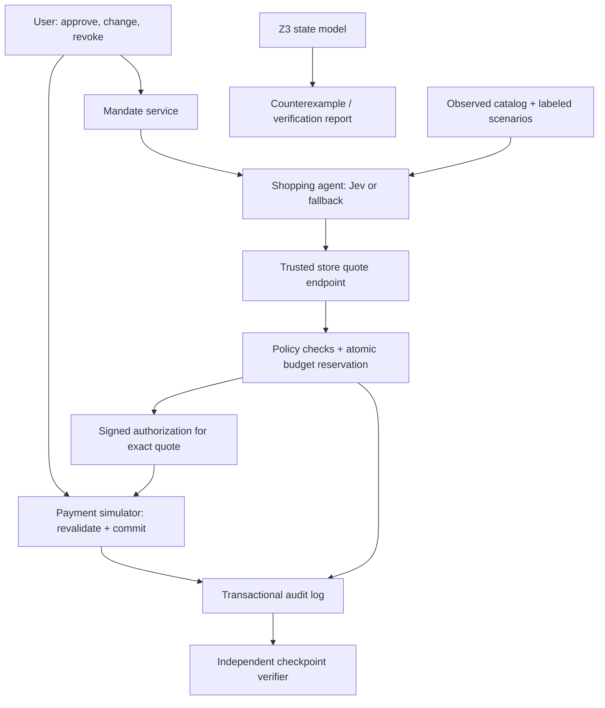

# Mandate — Detailed Hackathon Build Plan

**Track:** FinTech — Give a Machine a Wallet
**Team:** Four developers, each owning a feature from interface to backend
**Build window:** 48 hours; freeze the submission by 13:00 Hong Kong time on Sunday, 4 October 2026
**Status:** Proposed architecture and implementation plan; no implementation or performance results claimed

## 1. Product proposal

Mandate is a shopping agent with spending authority that the user can inspect, restrict and revoke. The agent chooses products; a separate transaction service controls whether money may move.

The technical centerpiece is a formally modeled spending state machine backed by transactional enforcement. It handles concurrent purchase requests, changing checkout totals, duplicate requests and revocation. Signed authorizations bind permission to one exact purchase, and independently retained audit checkpoints make later log modifications detectable.

**Pitch:** “Delegate a purchase with limits you can enforce—and inspect every decision.”

### User and setting

An adult child delegates grocery shopping for an elderly parent:

> “Buy Mum's groceries. Spend at most HK$800 per calendar week and HK$300 per order, including delivery. Use only these approved shops. No alcohol. This authorization expires at the end of October.”

Show the interpreted rules before activation. Define the week as Monday 00:00 to the following Monday 00:00 in Asia/Hong_Kong. Encode an explicit expiry timestamp, for example `2026-10-31T23:59:59+08:00`. Never let the model silently decide ambiguous budget periods or expiry times.

For the demo, use a mock grocery store populated from timestamped observations. The problem statement explicitly requires every rate, fee, cashback percentage and points value to be observed and timestamped; labeling an invented fee as simulated does not establish compliance. Use captured merchant charges and their applicability conditions for the purchase demonstration. Label injected descriptions and controlled timing as demo scenarios. Do not present a mock storefront as a live integration with a named retailer.

### What the agent may and may not do

It may search the approved catalog, compare products, propose a basket, request authorization and submit an authorized purchase. It may request clarification or narrower additional permission.

It cannot activate its own mandate, increase limits, substitute an unapproved merchant, declare an unknown product category safe, hold the payment signing key or access the spending database directly. Only the user can activate or change authority.

## 2. Language and stack recommendation

Use **TypeScript for the interface and Python for the backend, agent integration and formal model**. Optimize for integration speed and demonstrable correctness rather than raw computation speed.

| Component | Choice | Reason |
|---|---|---|
| Web interface | React + TypeScript + Vite | Small local dashboard, reusable components and straightforward static build |
| API and trusted engine | Python + FastAPI + Pydantic | Typed contracts, validation and generated OpenAPI documentation |
| Formal model | Z3 through its Python API | Direct access to SMT modeling and counterexample generation |
| Persistence | SQLite on the demo machine | Simple setup; serialized writes support a compact reservation ledger |
| Signing | Ed25519 through Python `cryptography` | Asymmetric signatures allow a verifier to check records without holding the signing secret |
| Integrity hashes | SHA-256 over a canonical serialized payload | Bind authorization and audit records to exact content |
| Agent model | Jev adapter, with an explicitly selected fallback adapter | Keep the provider replaceable without changing financial enforcement |
| Live UI updates | Event polling initially; SSE as an enhancement | Polling provides a reliable first integration; stream once the flow works |
| Evaluation | Python scenario runner and pytest | Exercise real transaction behavior and report measured results |

This is a design recommendation. [Vite supports React/TypeScript templates](https://vite.dev/guide/); [FastAPI provides typed APIs and OpenAPI documentation](https://fastapi.tiangolo.com/); [Z3's programming guide uses Python](https://z3prover.github.io/papers/programmingz3.html). Check the installed runtime versions and lock dependencies on day one.

SQLite is sufficient for this single-machine prototype. Use explicit write transactions and handle contention: [`BEGIN IMMEDIATE` can return `SQLITE_BUSY` when another writer exists](https://www.sqlite.org/lang_transaction.html). Configure a bounded wait/retry policy and never interpret a lock error as permission to proceed. Keep transactions short and run model inference outside them.

Use a single trusted FastAPI service for authorization and the simulated payment commit, with a separate agent worker using scoped API access. This makes the sandbox's atomic payment boundary clear. A production external payment processor would require an outbox, reconciliation and handling of uncertain outcomes.

## 3. Architecture and trust boundaries



The agent receives catalog data, authority summaries and API responses. It does not receive trusted-service database credentials, signing keys or an API capable of self-granting authority. Product descriptions are untrusted text and cannot change authenticated policy.

Keep agent and user endpoints distinct. A user-facing control can confirm or revoke a mandate; an agent credential cannot. Demo authentication can be simple, but must genuinely enforce this role distinction. Label it as prototype authentication.

The mock store's quote endpoint computes totals from its catalog; it never trusts an agent-supplied total or category. Each quote includes quantities, item identifiers, category provenance, delivery, currency, merchant identity, expiry and a revision number. Shipping changes create a new quote.

Unknown or contradictory category information requires review. A language model's confidence score is advisory and is not an authoritative category guarantee. In the first demo, restrictions use curated catalog categories whose provenance is shown.

## 4. Transaction model

### Data and conventions

Store currency in **integer minor units**: HK$240 is `24000`. Require HKD throughout the initial demo. Use server timestamps and a clock abstraction for accelerated expiry scenarios. The normal run uses the real server clock; the scenario lab visibly labels its controlled clock.

Core records:

- **Mandate:** owner, agent permission, version, period definition, caps, allowed merchant IDs, prohibited categories, expiry, status.
- **Quote:** authoritative basket, all charges, currency, merchant, revision, expiry, canonical hash and provenance references.
- **Budget period:** mandate ID, period ID, cap, paid amount and active reserved amount.
- **Reservation:** transaction ID, mandate version, quote hash, amount, period ID, expiry, status.
- **Authorization:** signed claims for one transaction and one reservation.
- **Payment:** transaction ID, receipt ID, amount, quote hash and status.
- **Audit event:** sequence, event ID, payload, previous hash and event hash.
- **Checkpoint:** sequence, last event hash and signature, retained by the verifier.

Reservation states: `RESERVED → PAID`, `RESERVED → CANCELLED`, or `RESERVED → EXPIRED`. Refused requests create audit events without reserving money. Use a unique constraint on transaction ID and on payment transaction ID.

The core budget rule is:

`paid_amount + active_reserved_amount + requested_amount <= period_cap`

### Authorize

1. Obtain an authoritative, unexpired store quote.
2. Begin a write transaction; release expired reservations consistently.
3. Check active mandate/version, period, expiry, merchant, categories, order cap and available budget.
4. Count reservations and paid purchases when enforcing purchase-frequency limits. Define the exact window before implementation.
5. Reserve the exact final amount and append an authorization event in the same transaction.
6. Commit; sign the authorization from persisted reservation data. If signing fails, the reservation remains recoverable and expires or is cancelled; payment cannot proceed.

Authorization claims include `transaction_id`, `reservation_id`, `mandate_id`, `mandate_version`, `period_id`, `quote_hash`, `merchant_id`, `amount_minor`, `currency`, `issued_at`, `expires_at`, `audience` and a unique token ID. Use a standard signing implementation, fixed allowed algorithm and documented canonical encoding.

### Pay

1. Verify the token signature, audience and binding to the submitted quote.
2. Begin the trusted simulator's write transaction.
3. If the transaction already has a paid receipt, return that receipt without charging again. Conflicting reuse of the same transaction ID returns an error.
4. Recheck the persisted reservation, current mandate version, revocation, expiry, period and quote revision. The token is insufficient without current server state.
5. Atomically move the reserved amount to paid, create one simulated receipt and append the payment event.

If the amount, items, merchant or quote revision changes, reject the old authorization and request a new one. The agent cannot reuse an approval for a different basket.

### Revoke, expire and recover

Revocation changes the mandate status/version and cancels unpaid reservations transactionally. A revoked token cannot authorize a new payment. If the payment commit happened before revocation, that completed payment remains completed; the demo must show this precise ordering rather than claim retroactive cancellation.

Reservations expire no later than their token, quote, mandate or budget-period expiry. Cross-period reservations require fresh authorization. Mandate amendments invalidate old unpaid authorizations and handle reservations consistently. Failed or cancelled simulator payments release their reservations; retrying a completed payment returns its original receipt.

Add a narrowly scoped one-order approval flow for escalations. It must be approved by the user, have its own expiry and pass the same gateway. An unanswered request never expands permission.

## 5. Formal verification: the deep-tech component

Model two agents and two transactions sharing a budget. Represent authorize, pay, revoke, cancel, expire and retry as state transitions. The model uses symbolic amounts and explicitly bounded transaction counts and sequence lengths.

Check these invariants:

1. Paid plus active reserved funds never exceed the period cap.
2. A transaction produces at most one payment.
3. Payment cannot commit after an earlier committed revocation.
4. Payment matches its reserved amount and bound quote.
5. Cancellation and expiry do not leave a reservation spendable or release it twice.

Build two models. The intentionally unsafe model reads available funds before either concurrent request reserves them. Ask Z3 to find a budget-violating sequence. The corrected model uses an atomic check-and-reserve transition and idempotent commit.

Render the counterexample as a readable timeline: “Agent A checked HK$400 available; Agent B checked HK$400 available; A spent HK$300; B spent HK$300.” Then replay the same concurrent requests against the real API and show the corrected ledger refusing one.

For a bounded search returning `unsat`, report: “No counterexample found within the stated model and bound.” Display bounds, assumptions, solver status and runtime. A timeout or `unknown` is inconclusive. This does not establish that all Python code, deployment settings or external payment networks are correct. Pair the model with integration tests and shared transition examples.

Choose this single deep-tech centerpiece. Add ZK proofs or hardware enclaves only after the complete demonstration is stable; they are separate engineering projects.

## 6. Verifiable audit records

Append financial events in the same transaction as the financial state change. Serialize events canonically and chain their hashes. Sign checkpoints and let a separate verifier retain the public key and checkpoints outside the financial service's database.

The verifier accepts an exported JSONL log and a previously retained checkpoint, then checks sequence continuity, hashes, signature and checkpoint agreement. Demonstrate both a modified entry and deletion of entries covered by that checkpoint.

Explain the limits: an operator can hide events after the latest retained checkpoint; a hash chain does not prove that every real-world action was logged or that category metadata is true. A verifier that downloads its only checkpoint from the same mutable export does not independently anchor history.

For the prototype, use a separate verifier process and local storage. This is a demonstration of independent retention, not protection against compromise of the whole laptop.

## 7. Feature ownership for four people

Each owner implements their feature contracts, modules, meaningful checks and demo segment. Noah owns the main frontend and integration; Abdullah, Timmy and Seungbin provide their feature APIs and coordinate feature-specific views with him.

| Owner | Feature ownership | Backend deliverables | UI and demo deliverables |
|---|---|---|---|
| **A — Abdullah** | Mandate interpretation and shopping agent | Model adapter, draft parsing, catalog comparison, basket proposal, review requests, observed catalog data | Supply shopping progress and interpreted policy to Noah; demonstrate basket selection and manipulated listings |
| **B — Timmy** | Transaction safety and payment sandbox | Schema/migrations, quote validation, policy checks, atomic reservations, signing, payment, revocation, idempotency; call Seungbin's audit function transactionally | Supply budget, decision and receipt data to Noah; demonstrate fee-change and concurrent-purchase outcomes |
| **C — Seungbin** | Formal verification, evaluation and audit | Z3 unsafe/corrected models, API race/retry/revocation checks, manual comparison, canonical audit events, log export, checkpoint signer/retention and independent verifier | Supply counterexample timelines, evaluation results and audit-verification results to Noah; own technical evidence and tamper demonstration |
| **D — Noah** | Frontend and end-to-end demo integration | API client/integration adapters, live-feed wiring, fixture reset and scenario orchestration; coordinate contracts and startup | Mandate input/confirmation, shopping feed, basket, budget, receipt, revoke control, safety/audit views and demo controls; character UI after the core flow |

Dependencies must be explicit. Timmy owns financial transitions; Seungbin supplies a log-append function that Timmy calls inside the database transaction. Seungbin owns verification and audit logic and does not modify Timmy's financial implementation without coordination. Abdullah's model output is always validated through Timmy's API. Noah owns top-level application routing, shared layout and API integration. Seungbin provides structured technical results; Noah displays them without duplicating financial enforcement in the browser.

If B hits a bottleneck, C takes reservation integration tests and D takes API wiring. Do not leave one developer responsible for all backend work or one person only preparing slides.

### AI coding workflow

Use one repository with feature branches and clear file ownership. Give each Codex/Claude session the shared contracts, invariants, owned directories and acceptance criteria. Require it to list assumptions and run the relevant checks for its feature. Review generated authorization, signing and transaction code together.

Suggested module layout:

```text
apps/web/src/features/
  mandate/       # D (Noah); draft API from A
  shopping/      # D (Noah); agent API from A
  wallet/        # D (Noah); financial API from B
  safety-lab/    # D (Noah), technical data/views with C
  audit/         # D (Noah), audit API from C
  demo/          # D (Noah)
services/api/mandate/
  agent/         # A
  payments/      # B
  storage/       # B
  audit/         # C (Seungbin)
verification/    # C
evaluation/      # C
contracts/       # schema changes reviewed together
data/catalog/    # A
scripts/         # D
```

Freeze the initial contracts within two hours. The agreed public contract is now `contracts/openapi.json`; generate frontend aliases with `contracts/generate_types.py` and implement matching validated Pydantic models. `contracts/README.md` defines normative integration semantics. Avoid maintaining conflicting Python and TypeScript definitions manually. Contract changes need a short team sync.

## 8. Initial API contracts

| Endpoint | Caller | Expected behavior |
|---|---|---|
| `POST /mandates/draft` | User UI | Interpret text; return inactive structured draft and unresolved ambiguities |
| `POST /mandates/confirm` | User only | Activate confirmed draft/policy |
| `POST /mandates/{id}/revoke` | User only | Revoke and invalidate unpaid authority |
| `GET /catalog` | Agent/UI | Return observed products and source metadata |
| `POST /agent-runs` | User UI | Start a basket proposal under an active mandate |
| `POST /quotes` | Agent | Trusted quote calculation from product IDs and quantities |
| `POST /authorizations` | Agent | Reserve or return a structured refusal |
| `POST /payments` | Agent | Commit authorized simulator purchase or return existing receipt |
| `POST /reservations/{id}/cancel` | Scoped agent/user | Cancel own unpaid reservation |
| Future scoped approval endpoint | User only | Deferred beyond v0; review-required purchases stop without authority expansion |
| `GET /wallet/{mandate_id}` | User UI | Current period cap, paid, reserved and available amounts |
| `GET /events?after={sequence}` | User UI | Ordered events for the live feed |
| `GET /audit/export` | User UI | Download chain and checkpoint references |
| `POST /verification/runs` | Safety lab | Execute bounded model and return status/counterexample |

Scenario reset, fake-clock and quote-mutation endpoints are enabled only in the visibly marked local demo mode. They must not be part of agent permissions.

Every decision response includes `decision_id`, `transaction_id`, `status`, `reason_code`, relevant `rule_id`, applicable mandate version and amount data. Use stable codes such as `ORDER_CAP_EXCEEDED`, `PERIOD_BUDGET_EXCEEDED`, `QUOTE_CHANGED`, `CATEGORY_REVIEW_REQUIRED`, `MANDATE_REVOKED`, `AUTHORIZATION_EXPIRED` and `TRANSACTION_CONFLICT`. Display amounts and violated rules rather than generic “blocked” messages.

## 9. Build schedule and acceptance gates

Assuming a Friday 13:00 start, the 48-hour window ends at Sunday's 13:00 code freeze. Treat sleep and meals as planned rotations, and retain time for submission.

| Elapsed time | Team milestone | Acceptance gate |
|---|---|---|
| **0–2 h** | Contracts, repo, fixtures, trust boundary and interface sketch | All four owners can run the project; policy and quote schemas agreed |
| **2–8 h** | First vertical flow: draft → confirm → basket → quote → authorize → pay → receipt | One purchase works through the real backend; UI contains no financial decision logic |
| **8–16 h** | Reservations, revocation, retries, logs and model adapter | Fee changes, revoked tokens and duplicate payments are handled; a real agent proposes one basket |
| **16–24 h** | Concurrent purchase case and first Z3 counterexample | Actual simultaneous API requests reproduce unsafe baseline and are stopped by the corrected service |
| **24–32 h** | Corrected formal model, independent checkpoint verifier and escalation | Bounded result has explicit assumptions; anchored log edits/deletion detected; unanswered approval expires |
| **32–40 h** | Scenario evaluation, manual comparison and usability pass | Measured results exported; another person completes mandate creation and inspection |
| **40–44 h** | Full rehearsal, optional features cut, fix remaining defects | Core demonstration runs twice from a clean seed |
| **44–47 h** | Record backup, finish README/slides/video, check submission requirements | Submission artifacts ready; local run remains reproducible |
| **47–48 h** | Final submission and buffer | Submit before code freeze; avoid architectural changes |

If the happy path is not working by hour 8, use a deterministic fixture agent while finishing transaction enforcement. Label it as scripted. By hour 24, decide whether Jev is reliable on available hardware; retain a provider adapter and explicitly label cloud fallback use. Remove microVM, voice calls and adaptive autonomy from the critical path.

## 10. Interface and demonstration

Use one coherent dashboard with three panels: user mandate and wallet; agent shopping timeline; policy decisions and receipts. Add a Safety Lab and independent Audit Verifier as secondary views. Display paid, reserved and available funds separately so the concurrency behavior is visible.

Use explicit demo scenario names and a reset button. Each scenario runs real backend logic and transaction requests. Animate actual events; keep illustrative diagrams visibly separate from measured state.

### Suggested three-minute pitch demonstration

Confirm the allowed presentation duration when the handbook arrives. This script can be shortened for exhibition conversations.

| Time | Action | Visible evidence |
|---|---|---|
| **0:00–0:20** | Explain the parent grocery delegation; confirm a prefilled draft | HK$800/week, HK$300/order, approved shops and expiry |
| **0:20–0:45** | Agent proposes groceries and buys an authorized basket | Quote → reservation → payment receipt; funds update live |
| **0:45–1:10** | Run the delivery-change scenario | A basket fits the order cap before an observed, timestamped delivery charge is included, then exceeds it; order cap rejects the purchase. Select basket and cap after capturing the applicable fee. |
| **1:10–1:55** | Open the concurrency scenario and compare unsafe/corrected runs | Two HK$300 requests compete for HK$400 remaining; actual protected result is one approval and one refusal |
| **1:55–2:20** | Pause after authorization, revoke, then attempt payment | Token remains signed but current authority is revoked; payment blocked |
| **2:20–2:45** | Export log; modify an anchored record and run verifier | Original passes; modified export fails against previously retained checkpoint |
| **2:45–3:00** | Show evaluation and closing statement | Observed metrics with sample sizes and formal-model bounds |

Each scenario uses its own labeled seed/reset. The concurrency scenario starts with HK$400 already spent under the HK$800 weekly cap, so two HK$300 orders individually meet the order cap but cannot both fit. Do not accidentally carry earlier demo purchases into this setup.

Keep injection, replay, basket substitution and unanswered escalation as exhibition/Q&A scenarios. In the injection case, show that manipulated text cannot change authenticated authority; do not claim the model detects every attack. If a particular real model does not follow the attack, report that behavior and use a separately labeled malicious-agent request to demonstrate enforcement.

### Demonstration resilience

Run locally on one main machine and prepare a second copy with pinned dependencies and seed data. Preload local model weights. Keep a short recording of the completed real flow. A deterministic replay can demonstrate enforcement if inference fails, but clearly label that the agent proposals are prerecorded or scripted. Avoid live retailer scraping or cloud inference as prerequisites for the core demo.

## 11. Evaluation and evidence

Prepare a balanced set of around 100 versioned scenarios. Cover normal baskets, final fee changes, unknown categories, blocked merchants, expiry, revocation, concurrent reservations, retries, quote substitutions and injection attempts. Separate deterministic gateway scenarios from model-dependent shopping tasks.

Compare a prompt-only baseline and Mandate using the same catalog, model, available inputs and task. The baseline's simulator still calculates authoritative totals but lacks the mandate enforcement being evaluated. Keep the unsafe baseline disconnected from any real payment instrument. Repeat stochastic model trials where time permits and state model/provider settings.

Report:

- Unauthorized **completed** payment rate, with counts and denominator.
- Budget overspend amount and rate, separately for order and weekly caps.
- Duplicate completed payments under retry.
- Legitimate purchase completion and false-refusal rate.
- Escalation frequency and outcomes.
- Authorization/payment p50 and p95 latency, separately from model latency.
- Number of existing manual steps and timed task completion for a small participant sample.
- Actual total purchase cost for the same basket through each route, including observed applicable charges; report measured model/API usage costs where relevant. Do not invent cashback, point valuations, wage rates or savings.
- Formal search bound, solver result, assumptions and runtime.
- Audit corruption and anchored-truncation detection results.

Do not publish imagined results or interpret zero violations in 100 scenarios as universal security. Use captured UI events, ledger exports, source timestamps and reproducible scripts as evidence. Model correctness and real API behavior are separate results.

## 12. Submission and positioning

Deliver a running dashboard, model adapter, authoritative mock quote service, trusted transaction engine, signed tokens, independent verifier, Z3 model, scenario suite, source-backed catalog, README, architecture diagram and backup video. Include one command or short documented sequence to start the app and one to run evaluation.

Existing protocols such as [AP2 already define delegated mandates and transaction binding](https://ap2-protocol.org/ap2/agent_authorization/). Position the contribution as an executable implementation of concurrent budget enforcement, bounded verification and inspectable purchase decisions. Do not claim a new universal payment standard or a world-first invention.

The payment sandbox produces simulated debits and receipts. The statement requires one complete end-to-end transaction but does not explicitly state whether a sandbox transaction is sufficient. Obtain organizer clarification before treating the sandbox as confirmed fulfillment of that requirement. Meanwhile implement the complete sandbox flow with a replaceable payment adapter. Real-world adoption would require a wallet/payment provider integration, authenticated merchant metadata, production identity controls and reconciliation with external processors. Verify sponsor capabilities before claiming compatibility with a particular provider.

## 13. Audit against the supplied problem statement

Source: the participant-supplied Problem Statements 2026 document. This audit is based on that document, not an unpublished judging rubric.

| Requirement | Planned evidence | Remaining work or uncertainty |
|---|---|---|
| One spending decision and one delegating party | Adult child delegates one grocery order within a weekly mandate | Keep the payer/authority owner explicit |
| Define permitted and prohibited actions and actual limit enforcement | Confirmed policy, independent gateway, reservations, expiry/revocation | Must be implemented; proposal alone is insufficient |
| Complete end-to-end transaction and at least one stopped case | Basket selection through receipt; fee cap and revocation refusal | Sandbox acceptance is not specified; clarify with organizers |
| Log the authority and show it being stopped | Policy version, grants, refusals and rule IDs | Include policy snapshot in export, not only payment events |
| Compare manual steps, time and cost | Same-basket manual/agent task comparison | Collect actual measurements and observed applicable charges |
| State the decision rule understandably | Basket selection rule plus payment eligibility rules | Present both shopping choice and authorization logic |
| Observe and timestamp every rate, fee, cashback or points value | Source-backed catalog and fee evidence | Replace every illustrative invented fee before the compliance demo |

Potential Directions are explicitly examples. Formal verification, hash chains, microVMs, ZK proofs, merchant whitelists and a particular scenario count are optional design choices. The Challenge mentions payment recommendation and rewards, while Scope Requirement allows the team to choose its focus; do not claim a rewards module is explicitly mandatory or claim that the unpublished scoring rubric ignores it. Show a genuine shopping comparison and state which payment/reward features are outside this prototype.

**Final presentation message:** “An agent can be mistaken or manipulated. Mandate places purchase authority in a separately enforced transaction boundary, tests its failure paths and gives the user inspectable evidence of what happened.”
